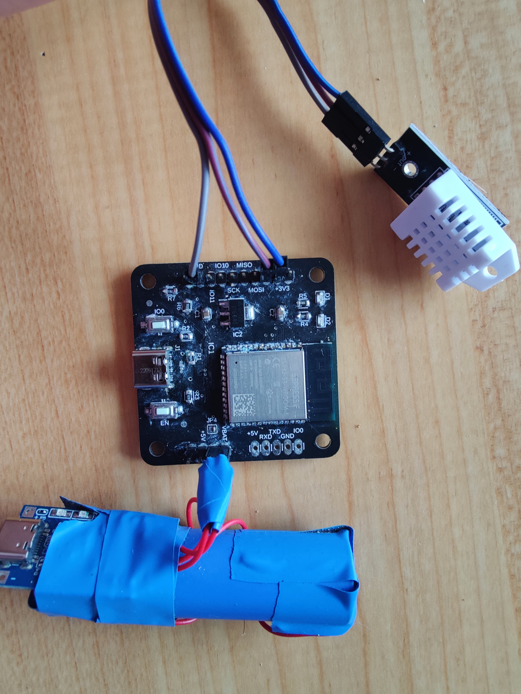

# ESP32 Temperature sensor
This project is a ESP32-S3 based board with the primary purpose of acting as a wireless temperature sensor interface. The temperature measuring is done by DHT22 sensor that is connected to the board. The board reads the sensor and sends the data to a home server.

This project was ment to replace a ESP8266 NodeMCU board to improve battery life. The NodeMCU board lasted 5-6 days on single charge with a used Li-ion 18650 battery. This board has accomplished **4 week** battery life with equivalent code and the exact same battery in winter conditions, and can be futher improved by electrically disconnecting the DHT sensor while microcontroller is asleep.

The board also includes the possibility to connect a SPI or I2C interface, to furhter improve the capabilities.

The Fusion360 design files and printed PDF files can be found under `doc/` folder

#### The board after 4 weeks of use:
